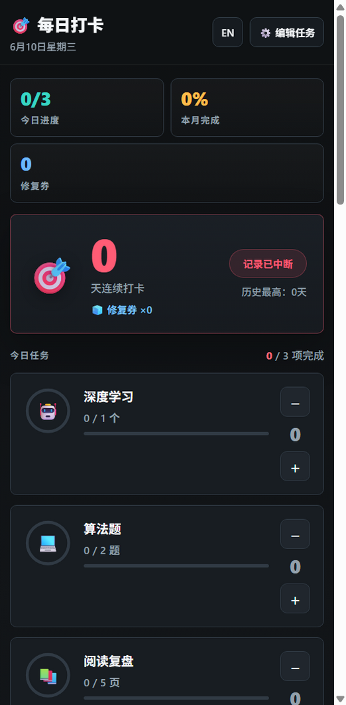

<p align="center">
  
</p>

<h1 align="center">🎯 每日打卡 Daily Check-in</h1>

<p align="center">
  一个离线优先、带激励反馈的习惯追踪器：连续打卡、断签修复券、热力图、成就徽章、云同步、打卡搭子、JSON 备份，一次到位。
</p>

<p align="center">
  
  
  
  
</p>

## 为什么值得一试

- **不是普通 todo list**：按“每日目标 + 连续反馈 + 成就解锁”设计，更适合学习、运动、阅读、刷题这类需要长期坚持的事情。
- **离线优先**：桌面版数据保存在本机 SQLite，浏览器版使用 localStorage，不连云端也完整可用。
- **可选云同步**：自带零依赖同步服务器（`src/server/server.js`），多设备字段级合并（LWW + 墓碑删除 + 修复日并集），令牌即身份，无需密码。
- **打卡搭子**：邀请码绑定一位搭子，互看今日状态与连续天数；“共同火焰”只在两人都完成的日子燃烧——一人断签，两人一起熄灭。
- **断签修复券**：每 7 个完美打卡日获得 1 张修复券，偶尔断一天也能保住长期节奏。
- **可视化反馈完整**：月历、热力图、当前连续天数、历史最长、月完成率、成就徽章都在一个界面里。
- **可导入导出**：一键导出 JSON，换设备、备份、迁移都方便。
- **代码结构清晰**：核心打卡计算在 `src/shared/core.js`，无 DOM / Electron 依赖，已配套 `node:test` 单元测试。

## 快速开始

```bash
npm install
npm test
npm start
```

也可以先用浏览器预览：

```bash
npm run web
```

然后打开终端输出的本地地址，默认是 `http://localhost:4173`。

## 常用命令

| 命令 | 说明 |
| --- | --- |
| `npm start` | 启动 Electron 桌面应用 |
| `npm run web` | 启动浏览器预览版（纯静态） |
| `npm run serve` | 启动云同步服务器（同时托管 PWA，默认 `http://localhost:8787`） |
| `npm test` | 运行核心逻辑 + 合并算法测试，以及服务器 API 全流程 E2E |
| `npm run build` | 打包 Windows portable 版本，产物输出到 `dist/` |

## 云同步与打卡搭子

1. 任意一台机器（或服务器）上运行 `npm run serve`，可用 `PORT`、`SYNC_DATA` 环境变量定制端口与数据文件位置。
2. 应用内「数据管理」填入服务器地址和昵称，点「连接云同步」——注册即登录，令牌保存在本机。
3. 本地每次打卡后约 2.5 秒自动增量同步；多设备并发修改按“单元格级最新写入获胜”合并，修复日取并集，不会互相覆盖。
4. 「打卡搭子」卡片里把你的邀请码发给朋友，对方填入即配对成功。之后互相能看到今日是否完成、连续天数，以及两人的共同火焰 🔥——只在双方都完成的日子才会延续。

## 功能一览

- 自定义任务：名称、emoji、每日目标、单位都可编辑
- 今日进度：每个任务支持快速加减，完成后即时刷新状态
- 连续打卡：自动计算当前连续天数与历史最长记录
- 修复券机制：完美打卡累计奖励，用于补回昨日断签
- 月历视图：区分完美、部分完成、未打卡、已修复、今天
- 近半年热力图：像贡献图一样看到坚持轨迹
- 成就徽章：3 / 7 / 14 / 30 / 60 / 100 天连续记录
- 每日提醒：到点提醒未完成的今日任务
- 分享卡片：生成当天打卡卡片，方便晒进度
- JSON 导入导出：数据备份和迁移更安心
- 中英文切换：同一套核心文案支持双语

## 数据与隐私

桌面版数据默认保存在：

```text
%APPDATA%\daily-checkin\daily-checkin.sqlite
```

应用启动时会自动写入 `daily-checkin.sqlite.bak` 备份。如果主库损坏，会尝试回退到备份文件。浏览器预览版不会写 SQLite，而是使用当前浏览器的 localStorage。

## 项目结构

```text
.
├─ src/
│  ├─ electron/
│  │  ├─ main.js              # Electron 主进程、SQLite、IPC、安全边界
│  │  └─ preload.js           # contextBridge 白名单 API
│  ├─ renderer/
│  │  ├─ index.html           # 页面结构与样式
│  │  ├─ renderer.js          # UI 渲染、交互、提醒、分享卡片
│  │  ├─ storage.js           # 浏览器模式 localStorage 适配器
│  │  ├─ sync.js              # 云同步客户端与打卡搭子 UI
│  │  ├─ manifest.webmanifest # PWA 元数据
│  │  ├─ sw.js                # PWA 离线缓存
│  │  ├─ icon.svg             # 应用图标
│  │  └─ daily-checkin.json   # 首次启动迁移用示例数据
│  ├─ shared/
│  │  └─ core.js              # 纯函数领域逻辑，Node 与浏览器共用
│  └─ server/
│     └─ server.js            # 零依赖同步服务器与 PWA 静态托管
├─ scripts/
│  ├─ serve.js                # 纯静态本地预览
│  └─ capture-preview.js      # 生成 README 运行截图
├─ test/
│  ├─ core.test.js            # 核心逻辑单元测试
│  ├─ merge.test.js           # 同步合并与共同火焰测试
│  └─ server.e2e.mjs          # 服务器 API 全流程 E2E
└─ docs/
   └─ runtime-preview.png     # README 真实运行截图
```

## 安全设定

- `contextIsolation: true`
- `nodeIntegration: false`
- `sandbox: true`
- 页面带 CSP
- 禁止页面导航与新窗口弹出
- 使用单实例锁，避免两个应用实例同时写入数据库
- IPC 只暴露语义化操作，不把原始 SQL 暴露给渲染进程

## 路线图

短期计划见 [ROADMAP.md](ROADMAP.md)。云同步与打卡搭子已落地（自托管 `src/server/server.js`）；下一步方向：移动端原生封装（Capacitor 复用 `src/shared/core.js`）、搭子互推提醒、小组打卡与排行榜、截图自动化、更多平台打包。

## 参与贡献

欢迎提 issue、交 PR 或直接给使用体验建议。开始前可以先看 [CONTRIBUTING.md](CONTRIBUTING.md)。

如果这个项目对你有用，欢迎点一个 Star。它会让这个小工具更容易被同样想坚持做事的人发现。
